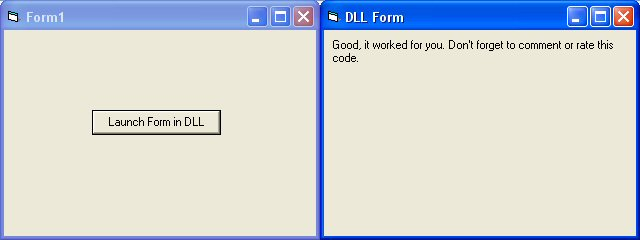



## Launch a Form in a DLL

### Description

Launches a form in a DLL file. Make sure you read the comments in the code for explaintion. Readme included also.
 
### More Info
 
No parameters

This example describes what a new user needs to know to launch a form in a DLL file. Make sure you read the comments in the code for explaintion. Readme included also.

This code brings up a dialog from the DLL file.

Closing the Form inside the EXE also closes out the form in the DLL (to prevent this go into the Loader class modules and after frmDLL.Show put 1 or vbModal after it).

             |
---                |---
**Submitted On**   |2005-07-06 18:09:44
**By**             |[K\. Campbell](https://github.com/Planet-Source-Code/PSCIndex/blob/master/ByAuthor/k-campbell.md)
**Level**          |Intermediate
**User Rating**    |4.5 (18 globes from 4 users)
**Compatibility**  |VB 6\.0
**Category**       |[Coding Standards](https://github.com/Planet-Source-Code/PSCIndex/blob/master/ByCategory/coding-standards__1-43.md)
**World**          |[Visual Basic](https://github.com/Planet-Source-Code/PSCIndex/blob/master/ByWorld/visual-basic.md)
**Archive File**   |[Launch\_a\_F191008762005\.zip](https://github.com/Planet-Source-Code/k-campbell-launch-a-form-in-a-dll__1-61568/archive/master.zip)

